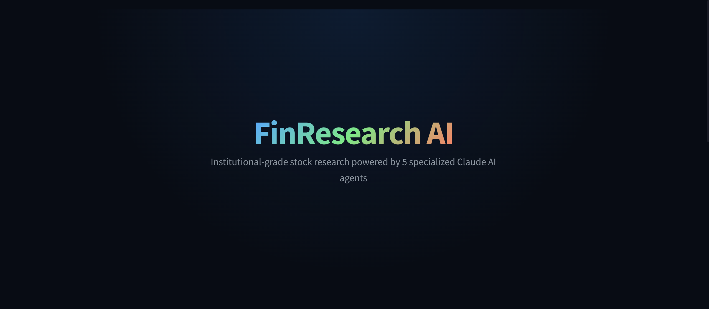
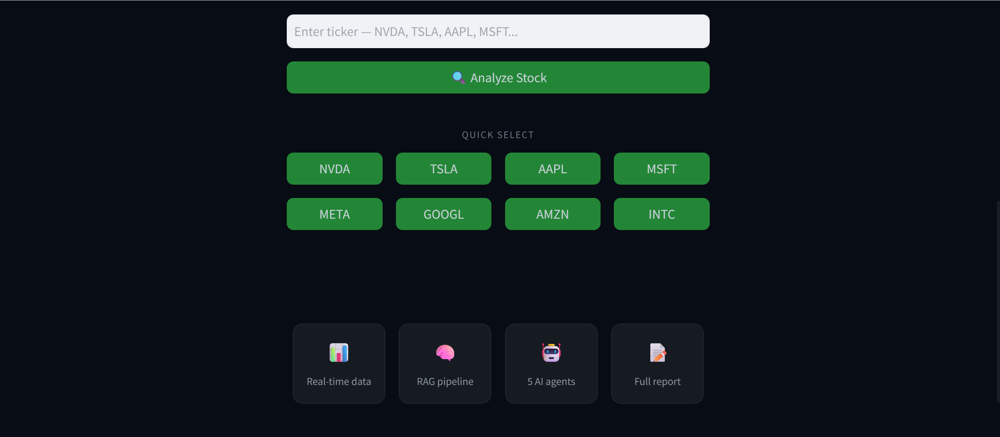
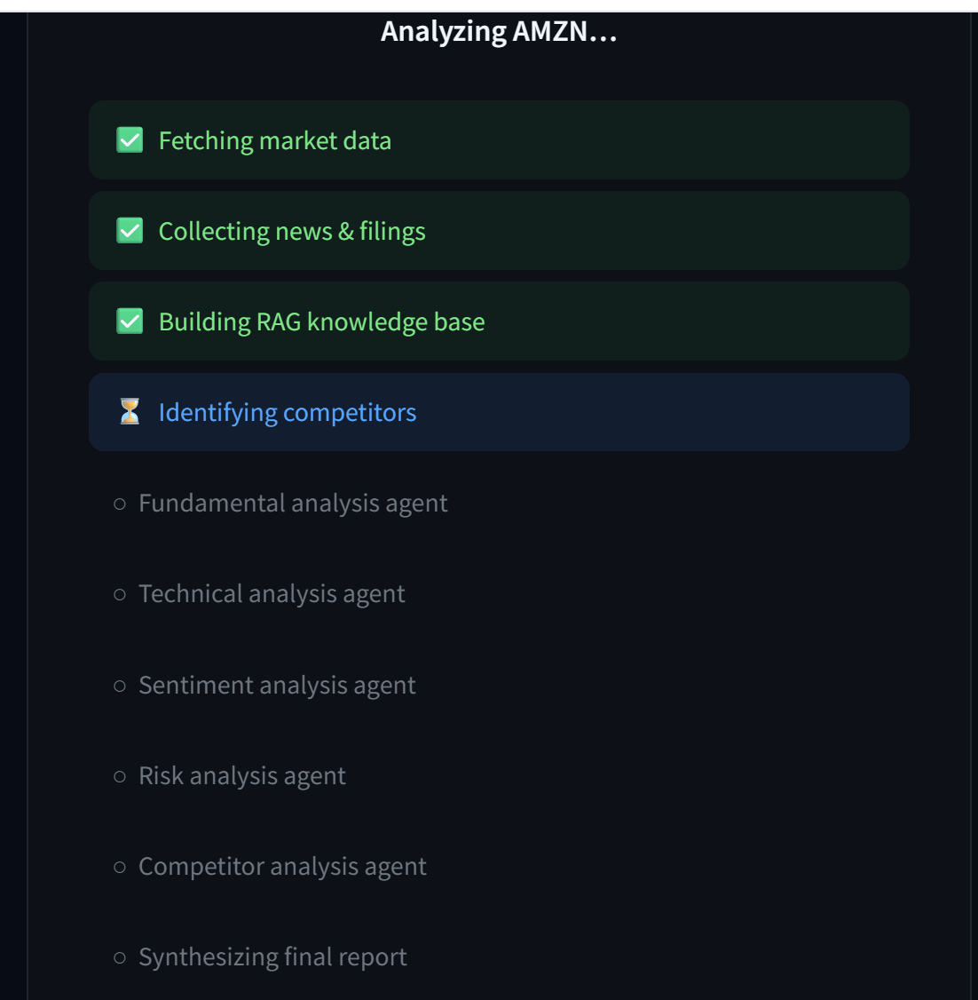
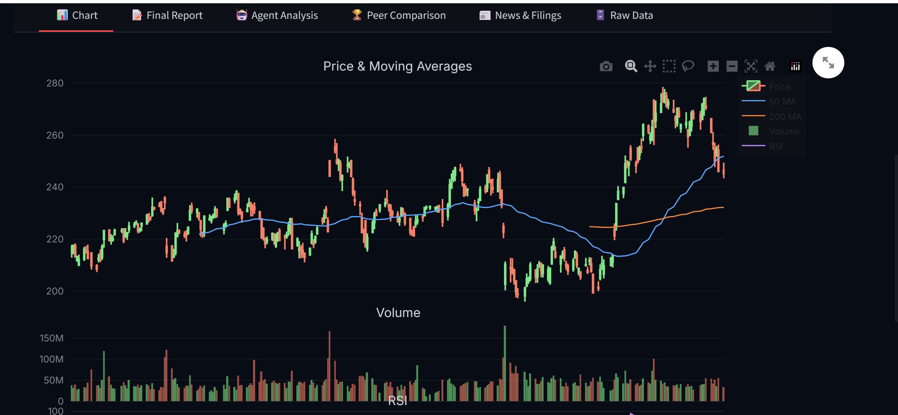
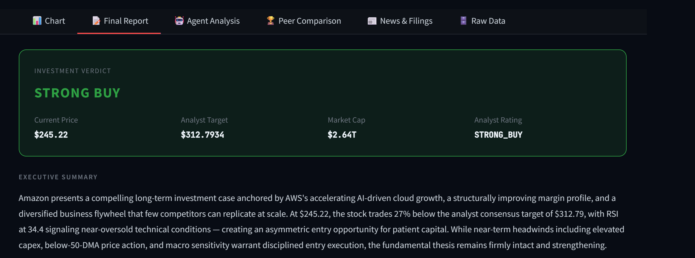
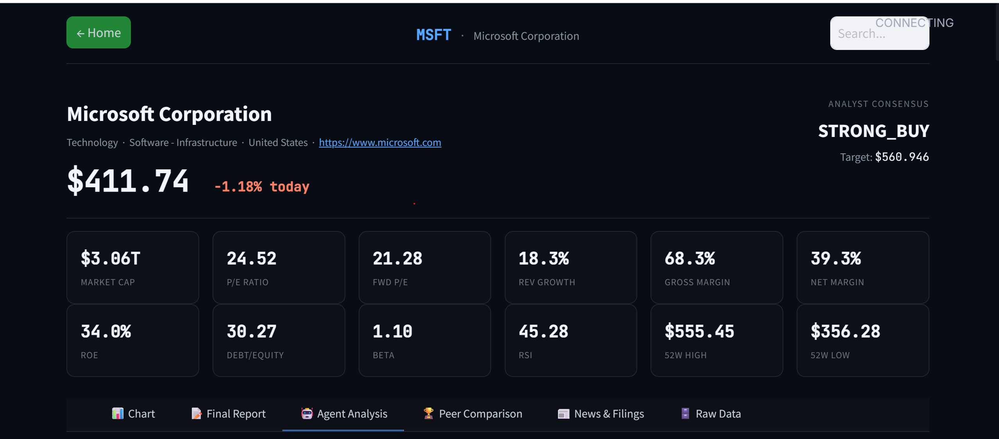
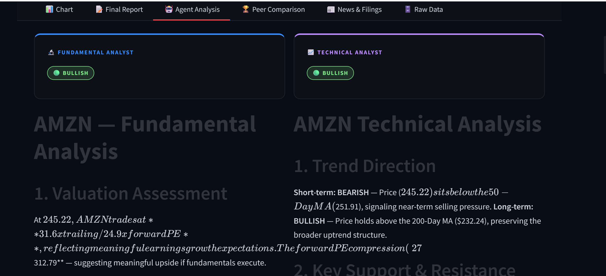
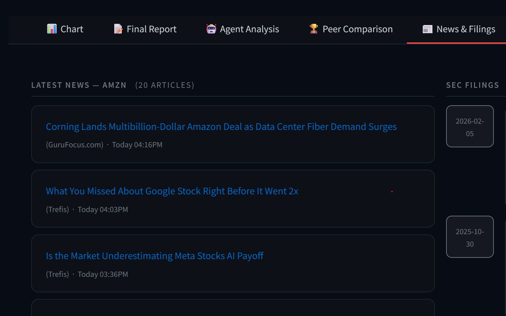
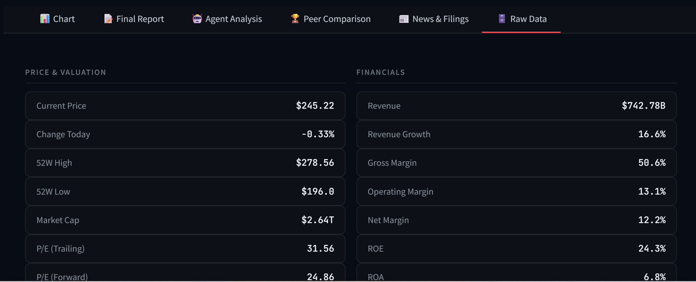

# FinResearch AI 📈

> Institutional-grade stock research powered by 5 specialized 
> Claude AI agents — Fundamental · Technical · Sentiment · 
> Risk · Competitor






## Features

- **5 AI Agents** — Fundamental, Technical, Sentiment, Risk, 
  Competitor — orchestrated via LangGraph
- **RAG Pipeline** — LangChain + FAISS vector store built from 
  real-time market data, news, and SEC filings
- **Real-time Data** — yfinance, FinViz news scraper, SEC EDGAR
- **Peer Comparison** — Automatic competitor identification with 
  side-by-side charts
- **Full Research Report** — Bull/Bear/Neutral color-coded 
  institutional-grade output
- **Raw Data Export** — All API data saved locally to data/ folder

## Screenshots

### Home — Search any ticker


### Live Analysis Progress


### Interactive Price Chart


### Final Research Report




### Agent Analysis — 4 Specialized Agents



### News & SEC Filings


### Raw Data



## Architecture
```
User Input (Ticker)
↓
Data Collection (yfinance + FinViz + SEC EDGAR)
↓
RAG Knowledge Base (LangChain + FAISS)
↓
LangGraph Multi-Agent Pipeline:
→ Fundamental Analyst Agent
→ Technical Analyst Agent
→ Sentiment Analyst Agent
→ Risk Analyst Agent
→ Competitor Analyst Agent
→ Chief Analyst (Final Report)
↓
Streamlit Dashboard
```

## Setup

### 1. Clone the repo
```bash
git clone https://github.com/YOUR_USERNAME/finresearch-ai.git
cd finresearch-ai
```

### 2. Install dependencies
```bash
pip install -r requirements.txt
```

### 3. Set up environment variables
```bash
cp .env.example .env
# Add your Anthropic API key to .env
```

### 4. Run
```bash
streamlit run app.py
```

## Environment Variables
ANTHROPIC_API_KEY=your_claude_api_key_here
Get your Claude API key at: https://console.anthropic.com

## Tech Stack

- **LLM** — Claude (Anthropic) via langchain-anthropic
- **Agent Orchestration** — LangGraph
- **RAG** — LangChain + FAISS
- **Market Data** — yfinance
- **News** — FinViz scraper
- **SEC Filings** — EDGAR API
- **Frontend** — Streamlit + Plotly
- **Data** — pandas, numpy

## Project Structure

```
finresearch/
├── app.py                  # Main Streamlit app + UI
├── requirements.txt        # Dependencies
├── .env.example            # Environment template
├── screenshots/            # README screenshots
└── src/
    ├── __init__.py
    ├── data_collector.py   # yfinance, FinViz, SEC EDGAR
    ├── rag_pipeline.py     # LangChain + FAISS RAG
    └── agents.py           # LangGraph multi-agent pipeline
```
## Disclaimer

This tool is for research and educational purposes only.
Not financial advice. Always do your own due diligence.
